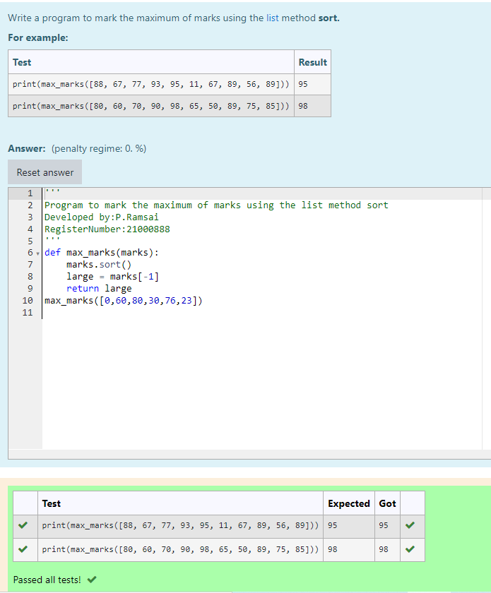
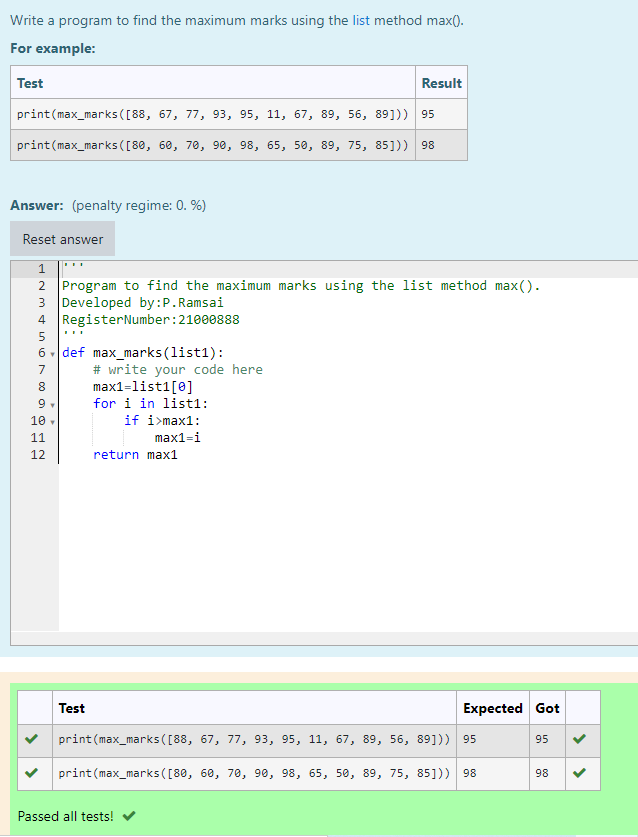
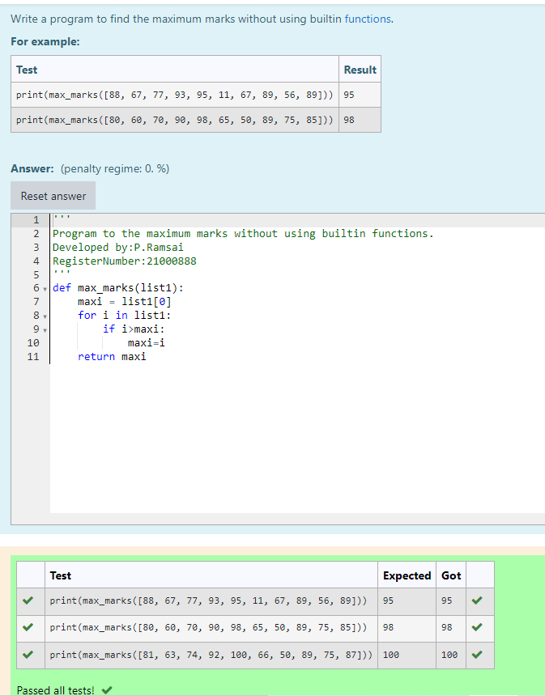

# Find the maximum of a list of numbers
## Aim:
To write a program to find the maximum of a list of numbers.
## Equipment’s required:
1.	Hardware – PCs
2.	Anaconda – Python 3.7 Installation / Moodle-Code Runner
## Algorithm:
1.	Get the list of marks as input
2.	Use the sort() function or max() function or use the for loop to find the maximum mark.
3.	Return the maximum value
## Program:

Program 1
~~~
/*
Program to mark the maximum of marks using the list method sort
Developed by:P.Ramsai
RegisterNumber:21000888 
/*
def max_marks(marks):
    marks.sort()
    large = marks[-1]
    return large
max_marks([0,60,80,30,76,23])
~~~

program 2
~~~
/*
Program to find the maximum marks using the list method max().
Developed by:P.Ramsai
RegisterNumber:21000888 
/*
def max_marks(list1):
    # write your code here
    max1=list1[0]
    for i in list1:
        if i>max1:
            max1=i
    return max1
~~~

program 3
~~~
/*
Program to the maximum marks without using builtin functions.
Developed by:P.Ramsai
RegisterNumber:21000888 
/*
def max_marks(list1):
    maxi = list1[0]
    for i in list1:
        if i>maxi:
            maxi=i
    return maxi
~~~

output

 
 
 

## Result:
Thus the program to find the maximum of given numbers from the list is written and verified using python programming.